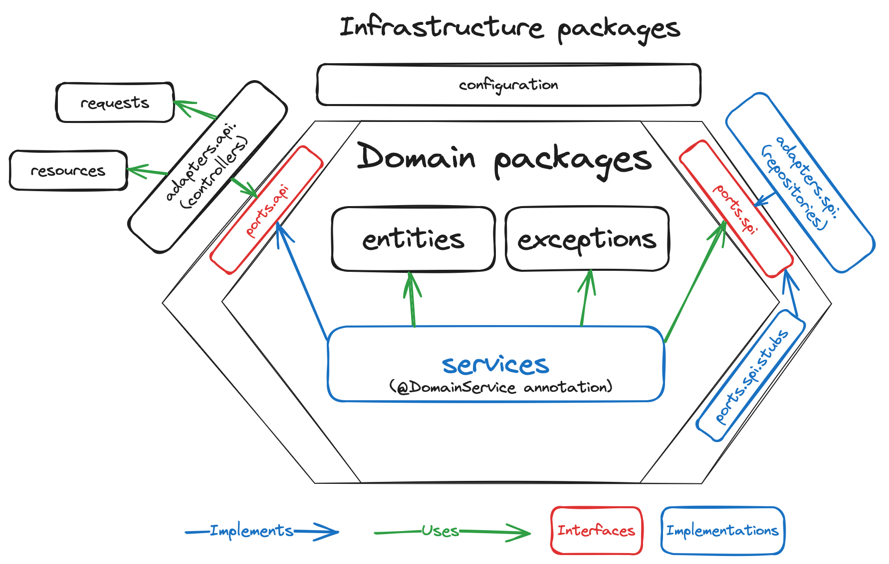
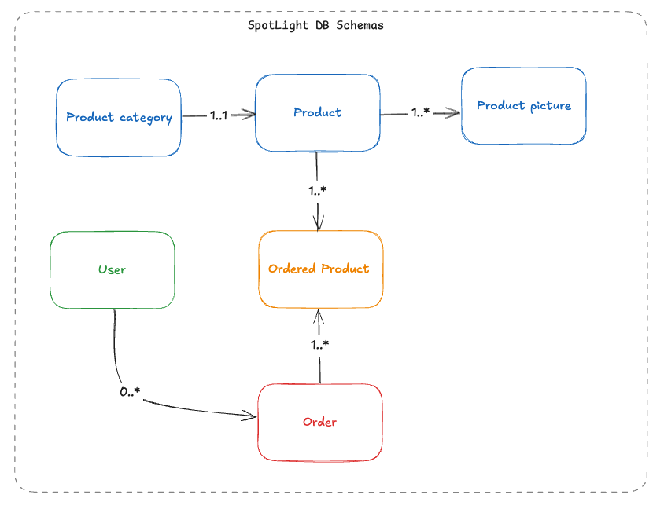

# Getting Started

## Spring BOOT 
**version : 3.5.0**

**Java JDK : 21**

## Pom.xml Contents

- spring-boot-starter-data-jpa
- spring-boot-starter-oauth2-resource-server
- spring-boot-starter-web
- liquibase-core
- lombok
- httpclient5
- mapstruct
- 

### Docker Compose support
This project contains a Docker Compose file named `compose.yaml`.
In this file, the following services have been defined:

* postgres: [`postgres:latest`](https://hub.docker.com/_/postgres)

### MapStruct support
This project contains MapStruct (v1.6.3) dependencies for mapping Entities to DTO

### Maven Parent overrides

Due to Maven's design, elements are inherited from the parent POM to the project POM.
While most of the inheritance is fine, it also inherits unwanted elements like `<license>` and `<developers>` from the parent.
To prevent this, the project POM contains empty overrides for these elements.
If you manually switch to a different parent and actually want the inheritance, you need to remove those overrides.

### Architecture
#### Hexagonal

### DB Schema
